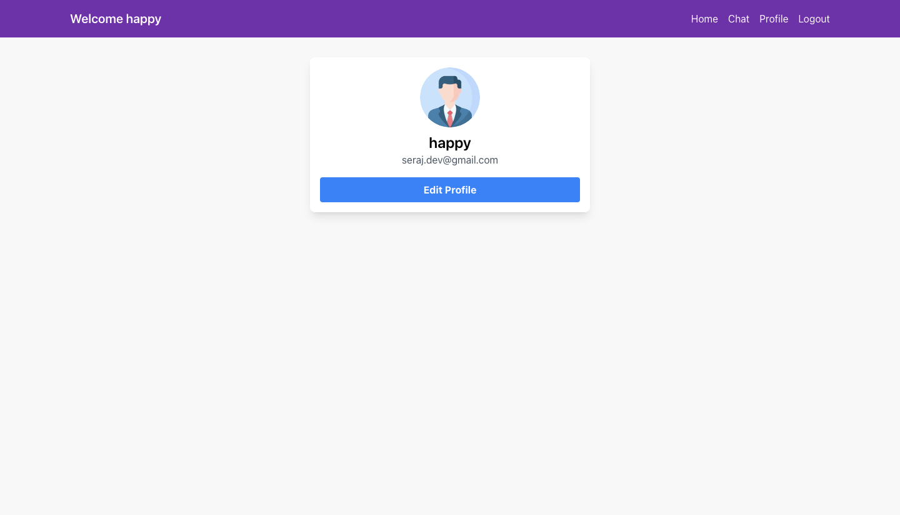

# Online coding platform

An online platform where you're able to practise coding and solve many different kinds of coding problems.

It is developed using the sphere-engine API, and you can use it to build submissions and run different test cases for your solution.


## Tech Stack

**Frontend:** React,TailwindCSS

**Server:** Node, Express, JWT, Socket.io, Nodemailer


## Run Locally

Clone the project

```bash
  git clone https://link-to-project](https://github.com/Serajj/code_editor.git
```

Go to the project directory

* Run server and frontend seprately.

### Server setup

```bash
  cd server
```

Create environment variables in ```.env``` file.

```bash
PORT=5000

MONGODB_URI
JWT_SECRET

SPHERE_SECRET
SPHERE_ENDPOINT

SMTP_HOST
SMTP_PORT
SMTP_USER
SMTP_PASS

```
Sphere engine documentation : https://docs.sphere-engine.com/index

Install dependencies

```bash
  npm install
```

Run the server

```bash
  nodemon index.js
```

```Note : For create admin account , first signup as a noral user then navigate to mongodb collection and change role to admin.```

### Frontend dashboard setup

```bash
  cd dashboard
```

Configure base URL

```src/config.js```

```bash
  const API_BASE_URL = <Add base url here , default : localhost:5000/api/>

```

Install dependencies

```bash
  npm install
```

Start the server

```bash
  npm run start
```
## Features

- Role base authentication , admin/participants
- User can login/regster
- Admin can add coding problems.
- Admin can add test cases to a problem
- User can write code and submit.
- User email verification.
- One to one chat using socket,
- Group chat.


## Screenshots

<h3> Authentication Screens </h3>
<div style="display: flex; flex-wrap: wrap; justify-content: center;">
    
    
    
</div>
<div style="display: flex; flex-wrap: wrap; justify-content: center;">
    
</div>
<h3> User Screens </h3>
<div style="display: flex; flex-wrap: wrap; justify-content: center;">
    
    
    
</div>

<h3> Admin Screens </h3>
<div style="display: flex; flex-wrap: wrap; justify-content: center;">
    
    
    
</div>
<div style="display: flex; flex-wrap: wrap; justify-content: center;">
    
    
    
</div>
<div style="display: flex; flex-wrap: wrap; justify-content: center;">
    
    
    
</div>

<h3> Profile Screens </h3>
<div style="display: flex; flex-wrap: wrap; justify-content: center;">
    
    
</div>

<h3> Chat Screens (Single and Group) </h3>
<div style="display: flex; flex-wrap: wrap; justify-content: center;">
    
    
    
</div>

<h3> Code Editor Screens (Integrated with Sphere engine API )</h3>
<div style="display: flex; flex-wrap: wrap; justify-content: center;">
    
    
    
</div>

## Demo

Will available soon

## 🚀 About Me
I'm a full stack developer...


## 🔗 Links
[](https://www.linkedin.com/in/serajj)
[](https://www.linkedin.com/in/serajj)
[](https://twitter.com/)


## Support

For support, email seraj.dev@gmail.com .

